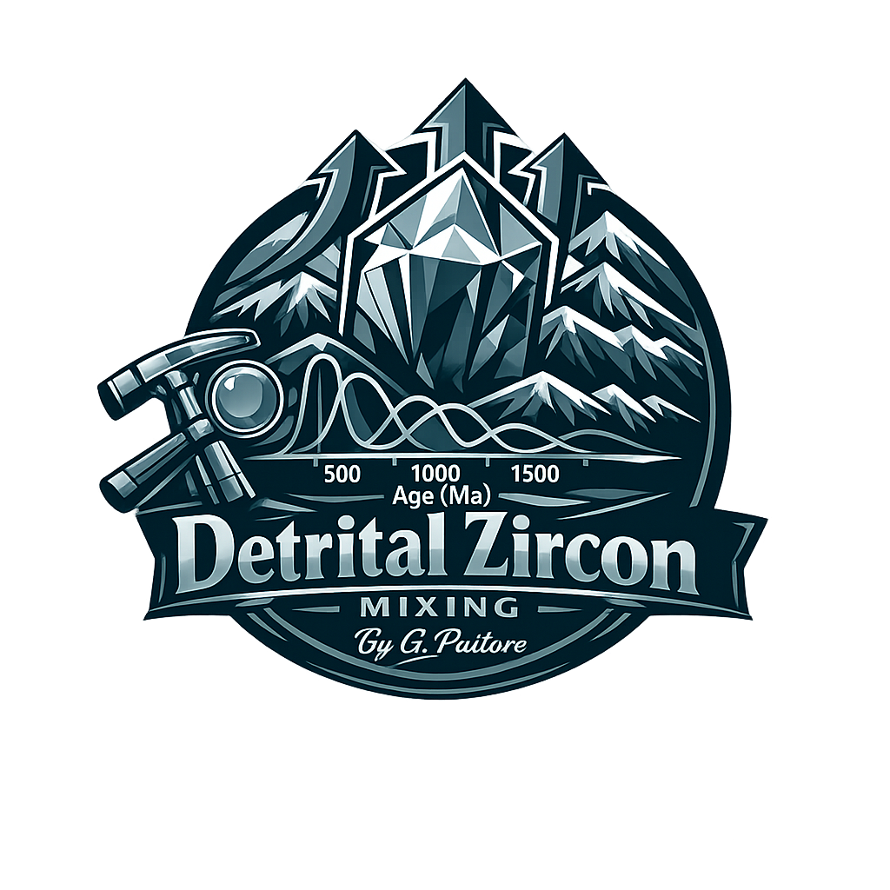

## Detrital Zircon Mixing 
by Guido Pastore (guidopastore93@gmail.com)

### Online Version:
https://gprussell.shinyapps.io/DetritalMixing/

### What this app does: 
Estimates the proportional contribution of up to 6 sediment source regions to a detrital sample (the 'sink'), based on U-Pb zircon age distribution similarity.

### Method: 
All possible mixtures of source distributions are tested at a chosen percentage grid (0.1-10%). Each synthetic mixture is compared to the sink using Kolmogorov-Smirnov (KS) and Wasserstein (WS / W2) distances. The smallest-distance combination is the best-fit provenance model. For >3 sources, the average of the top 1% solutions is also reported.

### Outputs: 
Proportions table (with sink label), CAD plots (KS & WS), downloadable mix vectors (150-point quantile), KDE, MDS, and interactive 3-D score surfaces.

### How to start: 
Upload a CSV (one sample per column, first row = sample name). Select the sink and 2-6 sources, choose a precision, click Run.

### Examples
Download Detrital Zircon dataset from the example folder and test it.
**Niger:** Pastore et al., 2023 https://doi.org/10.1029/2023JF007342
**Paraná** Garzanti et al., 2026  https://doi.org/10.1111/sed.70087
**Ogooué:** Study in progress... 

